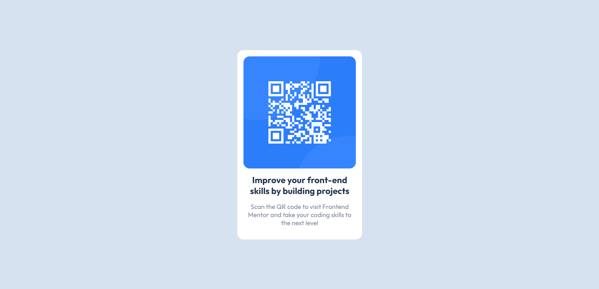

# Frontend Mentor - QR code component solution

This is a solution to the [QR code component challenge on Frontend Mentor](https://www.frontendmentor.io/challenges/qr-code-component-iux_sIO_H). Frontend Mentor challenges help you improve your coding skills by building realistic projects.

## Table of contents

- [Overview](#overview)
  - [Screenshot](#screenshot)
  - [Links](#links)
- [My process](#my-process)
  - [Built with](#built-with)
  - [What I learned](#what-i-learned)
  - [Useful resources](#useful-resources)

## Overview

### Screenshot



### Links

- [Solution URL](https://github.com/ywsoliman/qr-code-component)
- [Live Site URL](https://ywsoliman.github.io/qr-code-component/)

## My process

### Built with

- HTML
- CSS

### What I learned

```html
<main>...</main>
```

```css
.body {
  display: flex;
  justify-content: center;
  align-items: center;
  height: 100vh;
}
```

### Useful resources

- [W3Schools](https://www.w3schools.com/) - This helped me. I really liked this pattern and will use it going forward.
